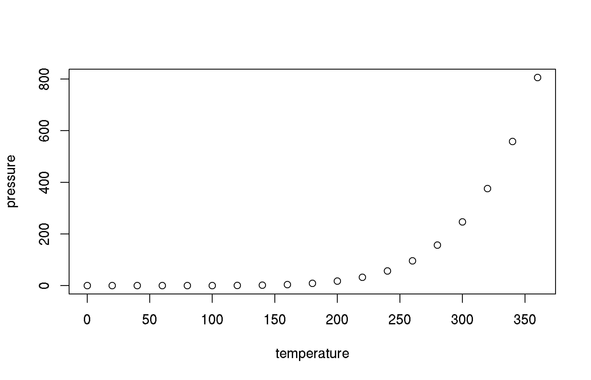

[](https://cran.r-project.org/package=networkABC)

<!-- README.md is generated from README.Rmd. Please edit that file -->


# networkABC

The goal of networkABC is to provide an inference tool based on approximate Bayesian computation to decipher network data and assess the strength of their inferred links.

This website and these examples were created by F. Bertrand and M. Maumy-Bertrand.

## Installation

You can install the released version of networkABC from [CRAN](https://CRAN.R-project.org) with:


```r
install.packages("networkABC")
```

You can install the development version of networkABC from [github](https://github.com) with:


```r
devtools::install_github("fbertran/networkABC")
```

## Examples

This is a basic example which shows you how to solve a common problem:


```r
## basic example code
```

What is special about using `README.Rmd` instead of just `README.md`? You can include R chunks like so:


```r
summary(cars)
#>      speed           dist       
#>  Min.   : 4.0   Min.   :  2.00  
#>  1st Qu.:12.0   1st Qu.: 26.00  
#>  Median :15.0   Median : 36.00  
#>  Mean   :15.4   Mean   : 42.98  
#>  3rd Qu.:19.0   3rd Qu.: 56.00  
#>  Max.   :25.0   Max.   :120.00
```

You'll still need to render `README.Rmd` regularly, to keep `README.md` up-to-date.

You can also embed plots, for example:



In that case, don't forget to commit and push the resulting figure files, so they display on GitHub!
