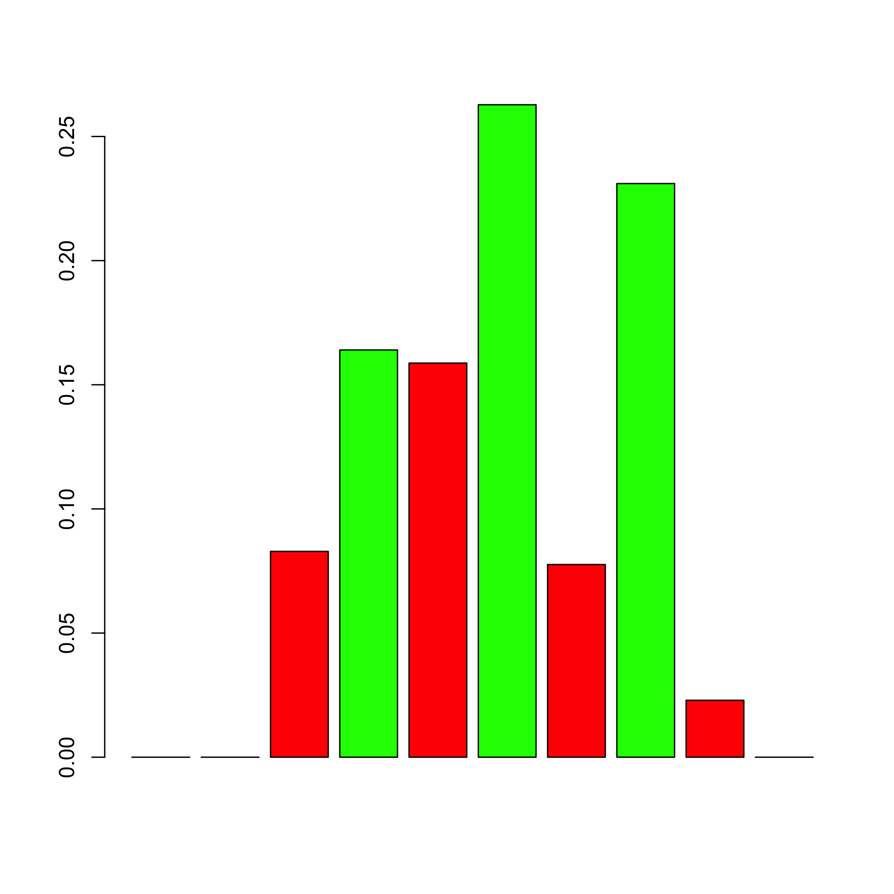
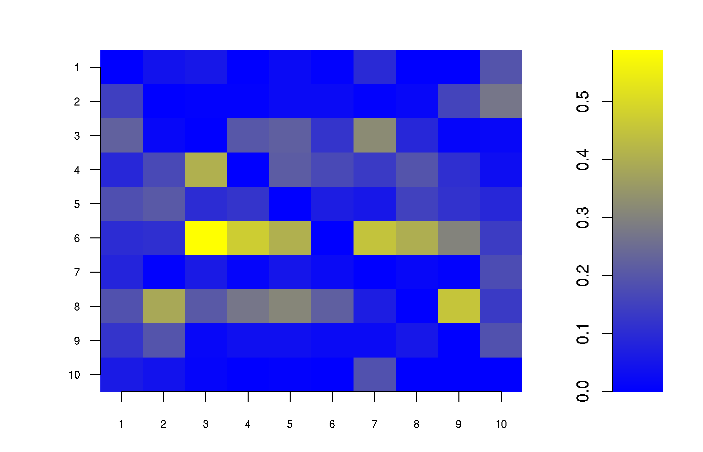
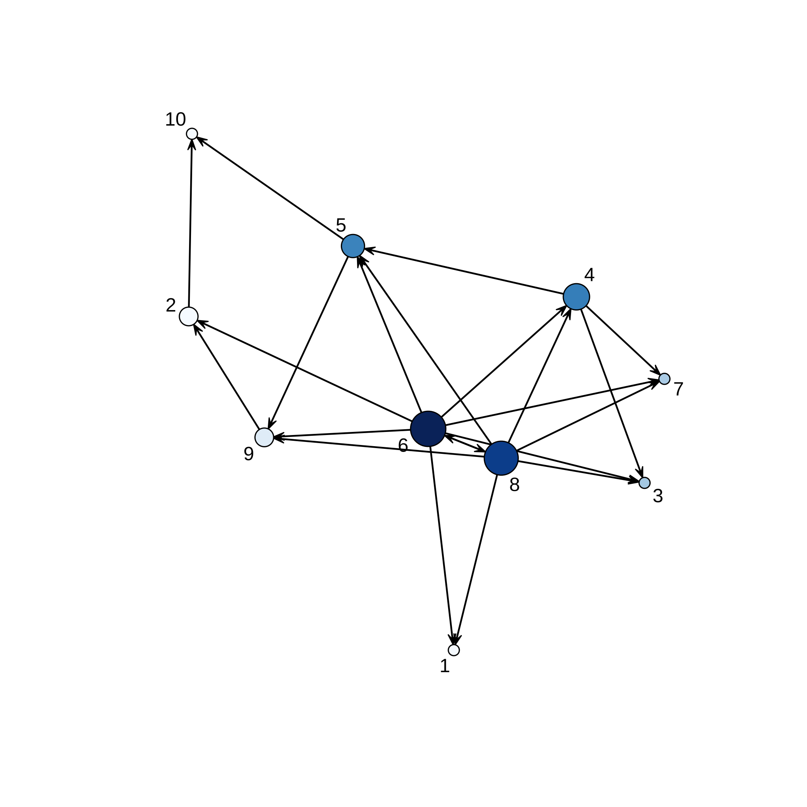

[](https://cran.r-project.org/package=networkABC)

<!-- README.md is generated from README.Rmd. Please edit that file -->


# networkABC

The goal of networkABC is to provide an inference tool based on approximate Bayesian computation to decipher network data and assess the strength of their inferred links.

This website and these examples were created by F. Bertrand and M. Maumy-Bertrand.

## Installation

You can install the released version of networkABC from [CRAN](https://CRAN.R-project.org) with:


```r
install.packages("networkABC")
```

You can install the development version of networkABC from [github](https://github.com) with:


```r
devtools::install_github("fbertran/networkABC")
```

## Examples

The network_gen allows to simulate networks with given clustering coefficient.

```r
set.seed(314)
library(networkABC)
resnet <- network_gen(10,1)
resnet
#> $number_genes
#> [1] 10
#> 
#> $clust_coef
#> [1] 1
#> 
#> $network
#>       [,1] [,2] [,3] [,4] [,5] [,6] [,7] [,8] [,9] [,10]
#>  [1,]    0    0    0    0    0    0    0    1    0     0
#>  [2,]    1    0    0    0    0    0    0    0    0     0
#>  [3,]    1    1    0    0    0    0    0   -1    0     0
#>  [4,]    0    0    0    0   -1    1    1    0    0     0
#>  [5,]    0    0    0    0    0    0    0    0    0     0
#>  [6,]    0    0    1    0    0    0    1    0    1    -1
#>  [7,]    0    0    0    0    0    0    0    0    0    -1
#>  [8,]    0    0    0    0    0    0    0    0    0     0
#>  [9,]    0    0    0    0    0    0    0    0    0     0
#> [10,]    0    0    0    0    0    0    0    0    0     0
```

The abcR function performs the network reverse engineering with Approximate Bayesian Computation.

```r
set.seed(314)
M10<-matrix(rnorm(30),10,3)
result<-abcR(data=M10)
#>       5% 
#> 4.294415
```

The showHp function plots the hub probabilities.

```r
showHp(result)
```



```
#>   gene.hubs hubs.proba
#> 1         4  0.1547619
#> 2         6  0.2482993
#> 3         8  0.2193878
```

The showNp function plots the neighbourhood probabilities.

```r
showNp(result)
```



The showNetwork function plots the final network.

```r
showNetwork(result,.2)
```


