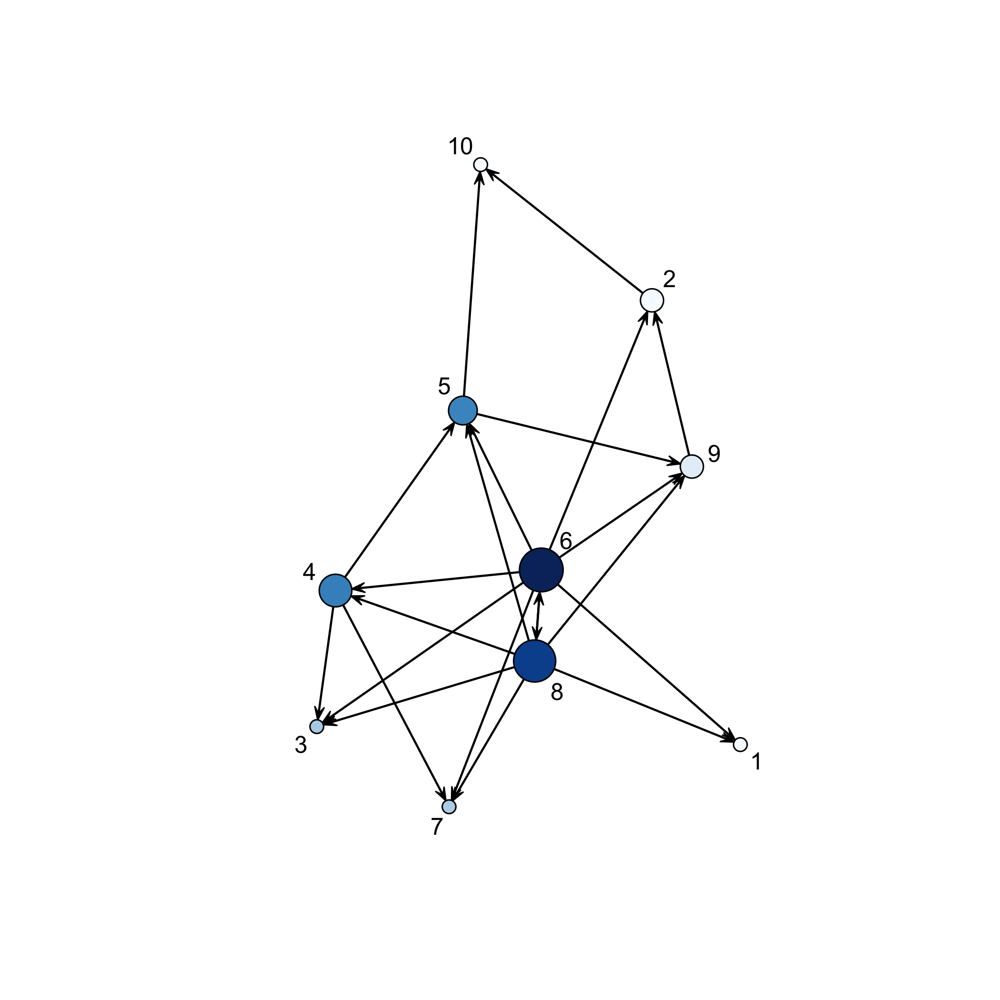

<!-- README.md is generated from README.Rmd. Please edit that file -->


# network ABC 

----------------

# Network Reverse Engineering with Approximate Bayesian Computation

## Frédéric Bertrand and Myriam Maumy-Bertrand

<https://doi.org/10.32614/CRAN.package.networkABC>

<!-- badges: start -->
[](https://doi.org/10.32614/CRAN.package.networkABC)
[](https://lifecycle.r-lib.org/articles/stages.html)
[](https://www.repostatus.org/#active)
[](https://github.com/fbertran/networkABC/actions)
[](https://app.codecov.io/gh/fbertran/networkABC?branch=master)
[](https://cran.r-project.org/package=networkABC)
[](https://cran.r-project.org/package=networkABC)
[](https://github.com/fbertran/networkABC)
<!-- badges: end -->

The goal of `networkABC` is to provide **an inference tool based on approximate Bayesian computation** to decipher network data and assess the strength of their inferred links.


We developed an inference tool based on approximate Bayesian computation to decipher network data and assess the strength of the inferred links between network's actors. 


It is a new multi-level approximate Bayesian computation (ABC) approach. 

* At the first level, the method captures the global properties of the network, such as scale-freeness and clustering coefficients, 
* whereas the second level is targeted to capture local properties, including the probability of each couple of genes being linked. 


Up to now, Approximate Bayesian Computation (ABC) algorithms have been scarcely used in that setting and, due to the computational overhead, their application was limited to a small number of genes. On the contrary, our algorithm was made to cope with that issue and has low computational cost. 


It can be used, for instance, for elucidating gene regulatory network, which is an important step towards understanding the normal cell physiology and complex pathological phenotype. Reverse-engineering consists in using gene expressions over time or over different experimental conditions to discover the structure of the gene network in a targeted cellular process. The fact that gene expression data are usually noisy, highly correlated, and have high dimensionality explains the need for specific statistical methods to reverse engineer the underlying network. 


The package was accepted for presentation at the the useR! 2021 international conference. A technical note for the package was created and published on the website of the conference. It can be accessed  here: [https://user2021.r-project.org/participation/technical_notes/t164/technote/](https://user2021.r-project.org/participation/technical_notes/t164/technote/). 


This website and these examples were created by F. Bertrand and M. Maumy-Bertrand.


## Installation

You can install the released version of networkABC from [CRAN](https://CRAN.R-project.org) with:


``` r
install.packages("networkABC")
```

You can install the development version of networkABC from [github](https://github.com) with:


``` r
devtools::install_github("fbertran/networkABC")
```

## Examples

The `network_gen` allows to simulate networks with given clustering coefficient.

``` r
set.seed(314)
library(networkABC)
resnet <- network_gen(10,1)
resnet
#> $number_genes
#> [1] 10
#> 
#> $clust_coef
#> [1] 1
#> 
#> $network
#>       [,1] [,2] [,3] [,4] [,5] [,6] [,7] [,8] [,9] [,10]
#>  [1,]    0    0    0   -1    1    1    0    0   -1    -1
#>  [2,]    0    0    0    0    0    0    0    0    0     0
#>  [3,]    0    0    0    0    0    0    0    0    0     0
#>  [4,]    0    0    0    0    0    0    0    0    0     0
#>  [5,]    0    0    0    0    0    0    0    0    0     0
#>  [6,]    0    0    0    0    0    0   -1    0    0     1
#>  [7,]    0    0    0    0    0    0    0    0    0     0
#>  [8,]    1    0   -1    0    0    0    0    0    0     0
#>  [9,]    0    0    0    1    0    0    0    0    0     0
#> [10,]    0    1   -1    0    0    0    0    0    0     0
```

The `abc` function performs the network reverse engineering with Approximate Bayesian Computation.

``` r
set.seed(314)
M10<-matrix(rnorm(30),10,3)
result<-abc(data=M10)
#> First run of abc to find tolerance
#> ===============================
#> Iteration=1
#> Accepted:1000
#> Probabilities of clustering coefficients:
#> 0.334000 0.345000 0.321000 
#> Tolerance value
#>       5% 
#> 4.224594 
#> ===============================
#> Beginning main run of abc
#> ===============================
#> Iteration=1
#> Accepted:69
#> Probabilities of clustering coefficients:
#> 0.362319 0.333333 0.304348 
#> ===============================
#> Iteration=2
#> Accepted:98
#> Probabilities of clustering coefficients:
#> 0.377551 0.316327 0.306122 
#> ===============================
#> Iteration=3
#> Accepted:113
#> Probabilities of clustering coefficients:
#> 0.495575 0.274336 0.230088 
#> ===============================
#> Iteration=4
#> Accepted:168
#> Probabilities of clustering coefficients:
#> 0.613095 0.226190 0.160714 
#> ===============================
#> Iteration=5
#> Accepted:130
#> Probabilities of clustering coefficients:
#> 0.700000 0.215385 0.084615 
#> ===============================
#> Iteration=6
#> Accepted:174
#> Probabilities of clustering coefficients:
#> 0.712644 0.235632 0.051724 
#> ===============================
#> Iteration=7
#> Accepted:145
#> Probabilities of clustering coefficients:
#> 0.737931 0.234483 0.027586 
#> ===============================
#> Iteration=8
#> Accepted:134
#> Probabilities of clustering coefficients:
#> 0.798507 0.179104 0.022388 
#> ===============================
#> Iteration=9
#> Accepted:143
#> Probabilities of clustering coefficients:
#> 0.825175 0.167832 0.006993 
#> ===============================
#> Iteration=10
#> Accepted:189
#> Probabilities of clustering coefficients:
#> 0.851852 0.142857 0.005291
```

The `showHp` function plots the hub probabilities.

``` r
showHp(result)
```

<div class="figure">

<p class="caption">plot of chunk showHp</p>
</div>

```
#>   gene.hubs hubs.proba
#> 1         4  0.1640212
#> 2         6  0.2627866
#> 3         8  0.2310406
```

The `showNp` function plots the neighbourhood probabilities.

``` r
showNp(result)
```

<div class="figure">

<p class="caption">plot of chunk showNp</p>
</div>

The `showNetwork` function plots the final network.

``` r
showNetwork(result,.2)
```

<div class="figure">

<p class="caption">plot of chunk showNetwork</p>
</div>
